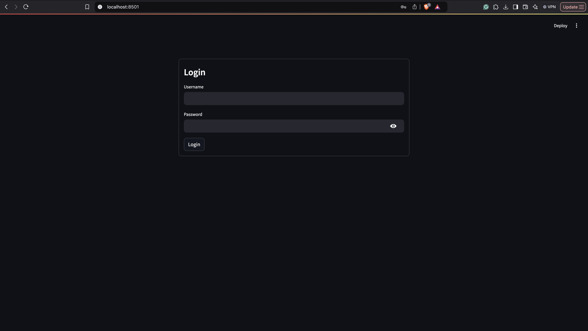
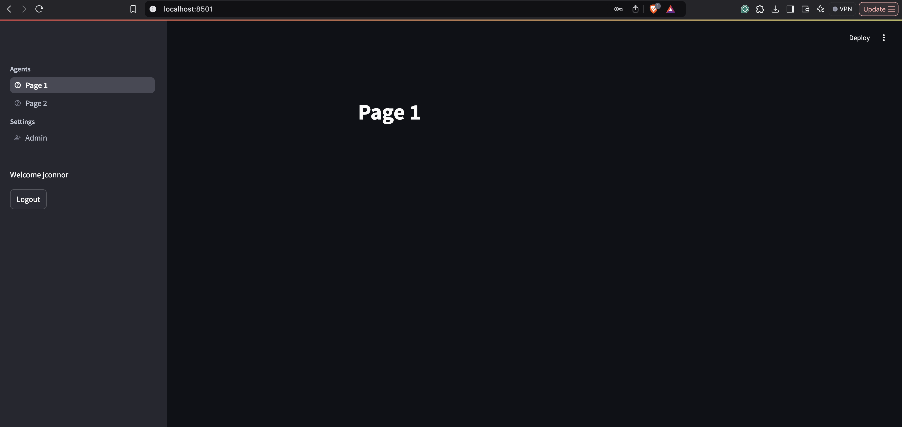

# Streamlit Demo Interface with login and multipages

## Features

- **User Authentication**: Secure login with credentials in `.secrets/config.yaml`.
    - can be changed to use a database
- **Role-Based Access**: Pages vary based on user roles; admins access additional settings.
- **Multi-Page Navigation**: Organized views for different functions.
- **Customizable UI**: Logo and layout adjustments.


## Setup

1. **Install Requirements**:
    ```bash
    $ pip install -r requirements.txt
    ```

2. Run the App:
    ```bash
    $ streamlit run src/app.py
    ```

## Images
Login Page



Multipages



# Try Out

## Link
[webpage](https://multi-page-withlgin.streamlit.app/)

## Login
- Role Admin:
    - username: jconnor
    - password: abc
- Role User:
    - username: sconnor
    - password: def

